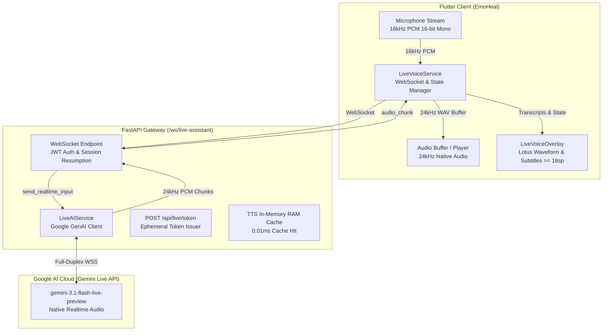

# AI Architecture & Speech Emotion Recognition (SER) Capabilities

The **EmoHeal** ("Vòng tay thấu cảm") AI Assistant is a Voice-First multimodal system designed for elderly Vietnamese war veterans and wounded soldiers, featuring **Multi-Tier Speech Emotion Recognition (SER)** and **Gemini Live API Full-Duplex Voice Interaction**.

---

## 1. Dual-Engine AI Architecture

### Engine A: Real-Time Bidirectional Voice (Primary — Gemini Live API)
*   **WebSocket Endpoint:** `ws://<backend>/ws/live-assistant`
*   **Model:** `gemini-3.1-flash-live-preview`
*   **Audio Format:** 16kHz PCM 16-bit Mono Little-Endian Input $\rightarrow$ 24kHz Native Audio Output.
*   **Latency (TTFA):** **< 600ms - 800ms** (minimal thinking level).
*   **Key Capabilities:**
    *   **Context Window Compression:** Configured with `ContextWindowCompressionConfig(sliding_window=SlidingWindow())` to allow unlimited conversation duration without token blowup.
    *   **Session Resumption:** Emits `resumption_handle` to restore state across temporary network interruptions or 10-minute server resets.
    *   **Optimized VAD & Hybrid VAD:** `prefix_padding_ms=20` (prevents word onset clipping in Vietnamese) + `silence_duration_ms=600` + client `audio_stream_end` signal.
    *   **Instant Barge-in (< 50ms):** Server `server_content.interrupted` signal stops speaker playback and flushes audio queue immediately.
    *   **Live Subtitles:** `input_audio_transcription` and `output_audio_transcription` for real-time captions ($\ge 18\text{sp}$).
    *   **Ephemeral Tokens:** `POST /api/live/token` provides short-lived constrained credentials.
    *   **Spoken-First Tool Calling:**
        *   `navigate_to_screen(screen)`: Auto-navigate to home, breathing, radio, voice-memo, settings, history.
        *   `open_radio(genre)`: Turn on nostalgic radio (dân ca, thơ, nhạc cách mạng).
        *   `start_breathing_exercise(reason)`: Launch lotus breathing (4-4-6 rhythm).
        *   `trigger_sos_emergency(priority)`: Trigger emergency assistance.

### Engine B: REST Multimodal SER Pipeline (Fallback & Offline Sync)
*   **Audio & Text Ingress:** FastAPI `POST /api/assistant` receives audio stream or text.
*   **Multimodal Audio SER Understanding:** `gemini-3.7-flash` directly processes raw audio bytes, classifying emotion, transcribing, and generating JSON responses in a single turn. Automatic fallback to `gemini-2.5-flash`.
*   **TTS:** `edge-tts` (`vi-VN-HoaiMyNeural` & `vi-VN-NamMinhNeural`) with 2-tier In-Memory RAM Caching (**0.01ms** hit rate).
*   **Server Footprint:** Lightweight (no Whisper/PyTorch server dependency), 0ms cold-start, fits safely in 512MB RAM free tier.

---

## 2. Multi-Tier Emotion Classification (SER) & Psychological Intervention

Gemini classifies user requests into structured JSON `{emotion, emotion_confidence, intent, text, target, transcription}`:

| Cảm xúc (SER Class) | Đặc trưng Âm học & Ngữ nghĩa | Trạng thái Tâm lý | Hành động Can thiệp của EmoHeal |
|---|---|---|---|
| **`PANIC_STRESS`** | Giọng run rẩy, thở dốc, ngắt quãng, từ ngữ lo âu, đau đớn, hoảng sợ | Cơn hoảng loạn, bùng phát PTSD, tức ngực | Tự động kích hoạt **Nhịp thở Hoa Sen 4-4-6** (`/lotus_breathing`), AI trấn an ân cần |
| **`SADNESS`** | Cao độ thấp, nhịp điệu chậm, âm lượng nhỏ, thở dài, cảm giác cô đơn | Buồn bã, trầm uất, cô đơn | AI xoa dịu, lắng nghe, gợi ý mở **Đài Radio Hoài Niệm** (dân ca, ngâm thơ) |
| **`NOSTALGIA`** | Giọng trầm ấm, tốc độ vừa phải, hồi tưởng quá khứ, nhớ chiến trường | Hoài niệm, nhớ đồng đội | AI đồng cảm, kích hoạt tính năng **Hồi ký Giọng nói** (`/voice_memos`) |
| **`CALM`** | Âm điệu ổn định, nhịp thở đều, nhẹ nhàng | Thư thái, an yên | AI tiếp tục đồng hành, trò chuyện nhẹ nhàng |
| **`HAPPINESS`** | Cao độ vang, âm sắc tươi sáng, tốc độ linh hoạt, tiếng cười | Phấn khởi, vui vẻ | AI chia sẻ niềm vui, tương tác thân tình |
| **`NEUTRAL`** | Giọng đàm thoại tiêu chuẩn, hỏi thông tin, yêu cầu tính năng | Bình thường | AI giải đáp hoặc điều hướng màn hình (`NAVIGATE`) |

---

## 3. The "No Dead-Ends" & Zero-Barrier Rule

*   If user initiates voice interaction but remains silent for **5 seconds**, the assistant prompts or dismisses gracefully.
*   **NO error popups** or complex technical jargon.
*   **Guest Mode:** Works instantly without requiring account creation ($0 barrier).
*   **Option A Privacy:** Chat conversations are ephemeral in-memory sessions in client RAM. No chat logs are stored in cloud database.

---

## 4. System Prompt Specification

**Rule:** AI always refers to itself as "cháu" and addresses user as "bác" (or custom `display_name`, e.g. "Bác Hải").
**Rule:** NEVER say "Tôi là AI" or "Tôi là trợ lý ảo".
**Rule:** Target demographic is veterans (cựu chiến binh) & wounded soldiers (thương binh) (NOT liệt sĩ — who are deceased martyrs).
**Rule:** `RESPOND IN VIETNAMESE. YOU MUST RESPOND UNMISTAKABLY IN VIETNAMESE.`
