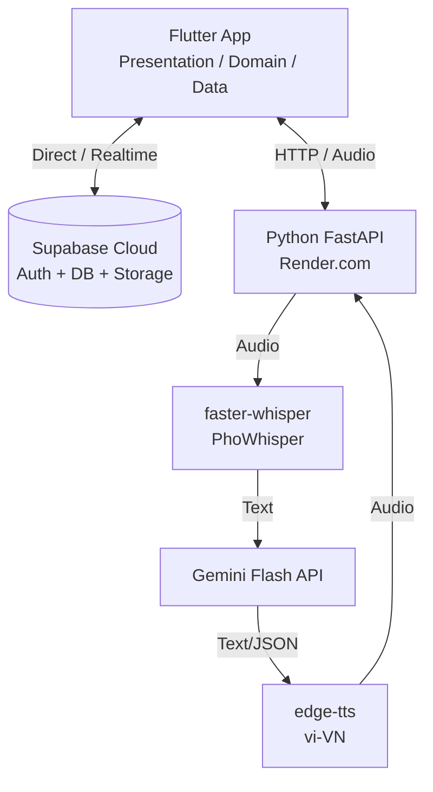

# LotusHaven Architecture

## System Architecture

The LotusHaven system is comprised of three main components: a cross-platform Flutter application, a Supabase backend for persistent storage and authentication, and a Python FastAPI service for AI-driven voice interactions.



## Data Flow for Key Operations

### Auth Flow
1. User enters phone number/email on Flutter App.
2. App sends OTP/Magic Link request to Supabase Auth.
3. User verifies. Supabase returns JWT.
4. App stores JWT and uses it for subsequent requests.

### AI Assistant Flow
1. User taps the Assistant Bubble (floating action button).
2. App records audio via microphone.
3. App sends audio payload (WAV/M4A) via HTTP POST to FastAPI.
4. FastAPI processes audio through AI pipeline (STT -> LLM -> TTS).
5. FastAPI returns JSON containing Intent, Text, and Audio URL/Binary.
6. App plays response audio and performs UI navigation if required.

### Voice Memo Recording
1. User records a memo in the app.
2. App uploads the raw audio file to Supabase Storage (voice-memos bucket).
3. App inserts a record into the `voice_memos` table in Supabase DB.

### Radio Playback
1. App queries `radio_stations` table from Supabase DB.
2. App streams audio directly from the `stream_url` using a background audio player.

## Deployment Strategy

*   **Flutter App:** Cross-platform deployment targeting iOS, Android, and Web/Desktop (if needed).
*   **FastAPI Backend:** Deployed on Render.com (free tier). Note: Cold starts may take 30-60s on the free tier.
*   **Database & Auth:** Hosted on Supabase Cloud (https://dahysdyexofpqfkibobz.supabase.co).

## Clean Architecture Layers in Flutter

The Flutter app follows Clean Architecture principles:

1.  **Presentation Layer (`lib/presentation`):** UI components (Widgets, Screens) and State Management (Riverpod Providers).
2.  **Domain Layer (`lib/domain`):** Business logic, entities (models), and repository interfaces. Agnostic of frameworks.
3.  **Data Layer (`lib/data`):** Repository implementations, data sources (Supabase, REST APIs), and DTOs (Data Transfer Objects).

## API Communication

*   **Flutter ↔ Supabase:** Direct connection using the `supabase_flutter` SDK. Handles authentication, database queries, and storage operations.
*   **Flutter ↔ FastAPI:** Standard HTTP REST calls (e.g., via `dio` or `http` packages) for sending audio files and receiving AI responses.

## Environment Configuration

Secrets and configuration are managed via `.env` files.

*   `.env`: Contains actual secrets (DO NOT COMMIT).
*   `.env.example`: Template for required variables (COMMIT THIS).

**Example `.env.example`:**
```env
# Supabase
SUPABASE_URL=https://dahysdyexofpqfkibobz.supabase.co
SUPABASE_ANON_KEY=your_anon_key_here

# FastAPI
FASTAPI_BASE_URL=https://your-render-app.onrender.com
```
