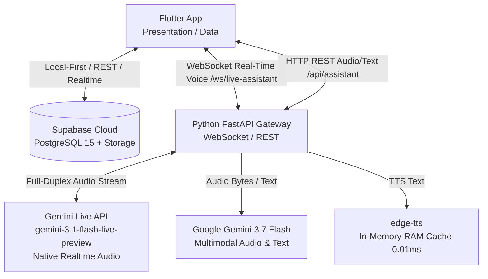

# EmoHeal Architecture

## System Architecture

The EmoHeal system is comprised of three main components: a cross-platform Flutter application, a Supabase backend for persistent storage and authentication, and a Python FastAPI service for AI-driven voice interactions.



## Data Flow for Key Operations

### Auth Flow
1. User enters phone number on Flutter App.
2. App sends 4-digit OTP request via FastAPI ($0 SMS budget) or Supabase.
3. User verifies with 4-digit code. System issues authenticated JWT.
4. App automatically syncs local offline data to Supabase Cloud.

### AI Assistant Flow
1. **Real-Time Mode (Primary):** User connects to WebSocket `/ws/live-assistant`. Gemini Live API handles native bidirectional speech with VAD, Barge-in interruption (< 50ms), Live Subtitles, and Session Resumption.
2. **REST Mode (Fallback):** App sends audio file or text via `POST /api/assistant`. Gemini 3.7 Flash natively listens, transcribes, and responds with JSON in a single call. Edge-TTS generates neural voice audio with In-Memory RAM Cache (0.01ms).

### Voice Memo Recording
1. User records a memo in the app.
2. App uploads the raw audio file to Supabase Storage (voice-memos bucket).
3. App inserts a record into the `voice_memos` table in Supabase DB.

### Radio Playback
1. App queries `radio_stations` table from Supabase DB.
2. App streams audio directly from the `stream_url` using a background audio player coordinated by `SoundCoordinator`.

## Deployment Strategy

*   **Flutter App:** Cross-platform deployment targeting Android, iOS, and Web.
*   **FastAPI Backend:** Deployed on Render.com or custom server with Pre-warmed Gemini & TTS RAM Cache.
*   **Database & Auth:** Hosted on Supabase Cloud.

## Clean Architecture Layers in Flutter

The Flutter app follows Clean Architecture principles:

1.  **Presentation Layer (`lib/presentation`):** UI components (Widgets, Screens) and Reactive Overlays (`LiveVoiceOverlay`, `AssistantBubble`).
2.  **Domain Layer (`lib/domain`):** Business logic, entities (models), and repository interfaces.
3.  **Data Layer (`lib/data`):** Repository implementations, data sources (`SupabaseService`, `ApiService`, `LiveVoiceService`).
4.  **Core Utilities (`lib/core`):** `SoundCoordinator`, `VoiceGuide`, `AppLogger`, `ResponsiveUtils`, `AppTheme`.

## Environment Configuration

Secrets and configuration are managed via `.env` files.

*   `.env`: Contains actual secrets (DO NOT COMMIT).
*   `.env.example`: Template for required variables (COMMIT THIS).

**Example `.env.example`:**
```env
# Supabase
SUPABASE_URL=https://your-project.supabase.co
SUPABASE_ANON_KEY=your-anon-key-here

# FastAPI Backend
BACKEND_URL=http://127.0.0.1:8000

# Google Gemini AI
GEMINI_API_KEY=your-gemini-api-key-here
```
