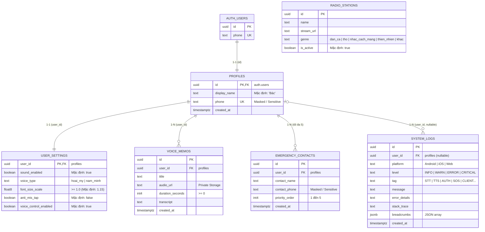

# Database Schema & Security (Supabase PostgreSQL)

This document outlines the streamlined Supabase database structure, Row Level Security (RLS) policies, and storage configurations for EmoHeal ("Vòng tay thấu cảm").

**Supabase Connection URL:** `https://dahysdyexofpqfkibobz.supabase.co`

---

## 1. Entity Relationship Diagram (ERD)



> **Ghi chú Kiến trúc:** Hội thoại với Trợ lý AI tuân theo **Phương án A (Session-based / Ephemeral)**: Toàn bộ tin nhắn trao đổi được lưu tạm trong bộ nhớ RAM của ứng dụng trong phiên đang mở để bảo vệ sự riêng tư tuyệt đối cho các Bác và đạt chi phí $0 Budget.

---

## 2. SQL Table Definitions

### 1. `profiles` (Hồ sơ người dùng)
```sql
CREATE TABLE public.profiles (
    id UUID REFERENCES auth.users(id) ON DELETE CASCADE PRIMARY KEY,
    display_name TEXT NOT NULL DEFAULT 'Bác',
    phone TEXT UNIQUE,
    created_at TIMESTAMPTZ NOT NULL DEFAULT now()
);
```

### 2. `user_settings` (Cài đặt trợ năng)
```sql
CREATE TABLE public.user_settings (
    user_id UUID REFERENCES public.profiles(id) ON DELETE CASCADE PRIMARY KEY,
    sound_enabled BOOLEAN NOT NULL DEFAULT true,
    voice_type TEXT NOT NULL DEFAULT 'hoai_my' CHECK (voice_type IN ('hoai_my', 'nam_minh')),
    font_size_scale DOUBLE PRECISION NOT NULL DEFAULT 1.15 CHECK (font_size_scale >= 1.0),
    anti_mis_tap BOOLEAN NOT NULL DEFAULT false,
    voice_control_enabled BOOLEAN NOT NULL DEFAULT true
);
```

### 3. `voice_memos` (Hồi ký giọng nói)
```sql
CREATE TABLE public.voice_memos (
    id UUID PRIMARY KEY DEFAULT gen_random_uuid(),
    user_id UUID NOT NULL REFERENCES public.profiles(id) ON DELETE CASCADE,
    title TEXT NOT NULL,
    topic TEXT,
    audio_url TEXT NOT NULL,
    duration_seconds INT NOT NULL DEFAULT 0 CHECK (duration_seconds >= 0),
    transcript TEXT,
    created_at TIMESTAMPTZ NOT NULL DEFAULT now()
);
```

### 4. `radio_stations` (Đài phát thanh hoài niệm)
```sql
CREATE TABLE public.radio_stations (
    id UUID PRIMARY KEY DEFAULT gen_random_uuid(),
    name TEXT NOT NULL,
    stream_url TEXT NOT NULL,
    genre TEXT NOT NULL DEFAULT 'nhac_cach_mang' CHECK (genre IN ('dan_ca', 'tho', 'nhac_cach_mang', 'thien_nhien', 'khac')),
    is_active BOOLEAN NOT NULL DEFAULT true
);
```

### 5. `emergency_contacts` (Danh bạ SOS khẩn cấp - Tối đa 5)
```sql
CREATE TABLE public.emergency_contacts (
    id UUID PRIMARY KEY DEFAULT gen_random_uuid(),
    user_id UUID NOT NULL REFERENCES public.profiles(id) ON DELETE CASCADE,
    contact_name TEXT NOT NULL,
    contact_phone TEXT NOT NULL,
    priority_order INT NOT NULL DEFAULT 1 CHECK (priority_order BETWEEN 1 AND 5),
    created_at TIMESTAMPTZ NOT NULL DEFAULT now()
);

-- Trigger giới hạn tối đa 5 liên hệ khẩn cấp
CREATE OR REPLACE FUNCTION public.enforce_max_emergency_contacts()
RETURNS trigger AS $$
BEGIN
  IF (SELECT COUNT(*) FROM public.emergency_contacts WHERE user_id = NEW.user_id) >= 5 THEN
    RAISE EXCEPTION 'Bác chỉ có thể lưu tối đa 5 liên hệ khẩn cấp.';
  END IF;
  RETURN NEW;
END;
$$ LANGUAGE plpgsql;

CREATE TRIGGER enforce_max_emergency_contacts
  BEFORE INSERT ON public.emergency_contacts
  FOR EACH ROW EXECUTE PROCEDURE public.enforce_max_emergency_contacts();
```

### 6. `system_logs` (Nhật ký Hệ thống & Kiểm toán cho Dev/Test/AI)
```sql
CREATE TABLE public.system_logs (
    id UUID PRIMARY KEY DEFAULT gen_random_uuid(),
    user_id UUID REFERENCES public.profiles(id) ON DELETE SET NULL,
    platform TEXT NOT NULL DEFAULT 'Mobile',
    level TEXT NOT NULL DEFAULT 'INFO' CHECK (level IN ('INFO', 'WARN', 'ERROR', 'CRITICAL')),
    tag TEXT NOT NULL,
    message TEXT NOT NULL,
    error_details TEXT,
    stack_trace TEXT,
    breadcrumbs JSONB NOT NULL DEFAULT '[]'::jsonb,
    created_at TIMESTAMPTZ NOT NULL DEFAULT now()
);
```

---

## 3. Row Level Security (RLS) & Data Privacy

```sql
-- Bật RLS
ALTER TABLE public.profiles ENABLE ROW LEVEL SECURITY;
ALTER TABLE public.user_settings ENABLE ROW LEVEL SECURITY;
ALTER TABLE public.voice_memos ENABLE ROW LEVEL SECURITY;
ALTER TABLE public.emergency_contacts ENABLE ROW LEVEL SECURITY;
ALTER TABLE public.radio_stations ENABLE ROW LEVEL SECURITY;
ALTER TABLE public.system_logs ENABLE ROW LEVEL SECURITY;

-- 1. profiles: Chỉ xem và sửa thông tin của chính mình
CREATE POLICY "Users can view own profile" ON public.profiles
    FOR SELECT USING (auth.uid() = id);
CREATE POLICY "Users can update own profile" ON public.profiles
    FOR UPDATE USING (auth.uid() = id);

-- 2. user_settings: Quyền sở hữu
CREATE POLICY "Users can access own settings" ON public.user_settings
    FOR ALL USING (auth.uid() = user_id);

-- 3. voice_memos: Riêng tư tuyệt đối
CREATE POLICY "Users can manage own voice memos" ON public.voice_memos
    FOR ALL USING (auth.uid() = user_id);

-- 4. emergency_contacts: Riêng tư tuyệt đối
CREATE POLICY "Users can manage own contacts" ON public.emergency_contacts
    FOR ALL USING (auth.uid() = user_id);

-- 5. radio_stations: Công khai cho mọi người
CREATE POLICY "Anyone can view active radio stations" ON public.radio_stations
    FOR SELECT USING (is_active = true);

-- 6. system_logs: Cho phép ghi log lỗi
CREATE POLICY "Allow public log insertion" ON public.system_logs
    FOR INSERT WITH CHECK (true);
```

---

## 4. Auto-trigger: `handle_new_user()`

```sql
CREATE OR REPLACE FUNCTION public.handle_new_user()
RETURNS trigger AS $$
BEGIN
  INSERT INTO public.profiles (id, phone, display_name)
  VALUES (new.id, new.phone, COALESCE(new.raw_user_meta_data->>'display_name', 'Bác'));
  
  INSERT INTO public.user_settings (user_id)
  VALUES (new.id);
  
  RETURN new;
END;
$$ LANGUAGE plpgsql SECURITY DEFINER;

CREATE TRIGGER on_auth_user_created
  AFTER INSERT ON auth.users
  FOR EACH ROW EXECUTE PROCEDURE public.handle_new_user();
```

---

## 5. Storage Buckets

1. `voice-memos`: **Private** — File `.m4a` ghi âm hồi ký của các Bác.
2. `avatars`: **Private** — Lưu ảnh đại diện nếu có.
3. `radio`: **Public** — Ảnh bìa và danh mục kênh phát thanh.
4. `tts-cache`: **Private** — Bộ đệm âm thanh giọng đọc hướng dẫn.
