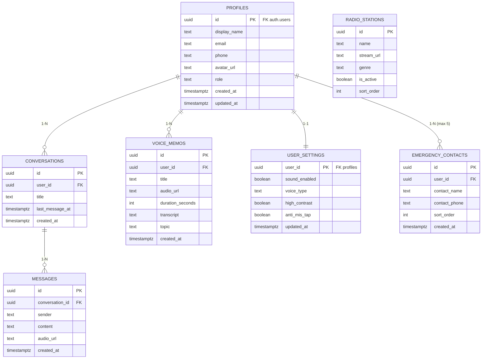

# Database Schema & Security

This document outlines the Supabase database structure, Row Level Security (RLS) policies, and storage configurations for LotusHaven.

**Supabase Connection URL:** `https://dahysdyexofpqfkibobz.supabase.co`

## Entity Relationship Diagram



## SQL Table Definitions

### 1. `profiles`
```sql
CREATE TABLE public.profiles (
    id UUID REFERENCES auth.users(id) PRIMARY KEY,
    display_name TEXT DEFAULT 'Bác',
    email TEXT UNIQUE,
    phone TEXT UNIQUE,
    avatar_url TEXT,
    role TEXT DEFAULT 'user' CHECK (role IN ('user', 'admin')),
    created_at TIMESTAMPTZ DEFAULT now(),
    updated_at TIMESTAMPTZ DEFAULT now()
);
```

### 2. `conversations`
```sql
CREATE TABLE public.conversations (
    id UUID PRIMARY KEY DEFAULT gen_random_uuid(),
    user_id UUID REFERENCES public.profiles(id) ON DELETE CASCADE,
    title TEXT,
    last_message_at TIMESTAMPTZ DEFAULT now(),
    created_at TIMESTAMPTZ DEFAULT now()
);
```

### 3. `messages`
```sql
CREATE TABLE public.messages (
    id UUID PRIMARY KEY DEFAULT gen_random_uuid(),
    conversation_id UUID REFERENCES public.conversations(id) ON DELETE CASCADE,
    sender TEXT NOT NULL CHECK (sender IN ('user', 'assistant')),
    content TEXT,
    audio_url TEXT,
    created_at TIMESTAMPTZ DEFAULT now()
);
```

### 4. `voice_memos`
```sql
CREATE TABLE public.voice_memos (
    id UUID PRIMARY KEY DEFAULT gen_random_uuid(),
    user_id UUID REFERENCES public.profiles(id) ON DELETE CASCADE,
    title TEXT,
    audio_url TEXT,
    duration_seconds INT,
    transcript TEXT,
    topic TEXT,
    created_at TIMESTAMPTZ DEFAULT now()
);
```

### 5. `radio_stations`
```sql
CREATE TABLE public.radio_stations (
    id UUID PRIMARY KEY DEFAULT gen_random_uuid(),
    name TEXT NOT NULL,
    stream_url TEXT NOT NULL,
    genre TEXT NOT NULL CHECK (genre IN ('dan_ca', 'tho', 'nhac_cach_mang', 'thien_nhien', 'khac')),
    is_active BOOLEAN DEFAULT true,
    sort_order INT DEFAULT 0
);
```

### 6. `user_settings`
```sql
CREATE TABLE public.user_settings (
    user_id UUID REFERENCES public.profiles(id) ON DELETE CASCADE PRIMARY KEY,
    sound_enabled BOOLEAN DEFAULT true,
    voice_type TEXT DEFAULT 'hoai_my' CHECK (voice_type IN ('hoai_my', 'nam_minh')),
    high_contrast BOOLEAN DEFAULT false,
    anti_mis_tap BOOLEAN DEFAULT false,
    updated_at TIMESTAMPTZ DEFAULT now()
);
```

### 7. `emergency_contacts`
```sql
CREATE TABLE public.emergency_contacts (
    id UUID PRIMARY KEY DEFAULT gen_random_uuid(),
    user_id UUID REFERENCES public.profiles(id) ON DELETE CASCADE,
    contact_name TEXT NOT NULL,
    contact_phone TEXT NOT NULL,
    sort_order INT DEFAULT 0,
    created_at TIMESTAMPTZ DEFAULT now()
);

-- Max 5 contacts per user / Giới hạn 5 liên hệ khẩn cấp
CREATE OR REPLACE FUNCTION public.enforce_max_emergency_contacts()
RETURNS trigger AS $$
BEGIN
  IF (SELECT COUNT(*) FROM public.emergency_contacts WHERE user_id = NEW.user_id) >= 5 THEN
    RAISE EXCEPTION 'Bác chỉ có thể lưu tối đa 5 liên hệ khẩn cấp.';
  END IF;
  RETURN NEW;
END;
$$ LANGUAGE plpgsql;

CREATE TRIGGER enforce_max_emergency_contacts
  BEFORE INSERT ON public.emergency_contacts
  FOR EACH ROW EXECUTE PROCEDURE public.enforce_max_emergency_contacts();
```

## Indexes for Performance

```sql
CREATE INDEX idx_conversations_user_id ON public.conversations(user_id);
CREATE INDEX idx_messages_conversation_id ON public.messages(conversation_id);
CREATE INDEX idx_voice_memos_user_id ON public.voice_memos(user_id);
```

## Row Level Security (RLS) Policies

Enable RLS on all tables:
```sql
ALTER TABLE public.profiles ENABLE ROW LEVEL SECURITY;
ALTER TABLE public.conversations ENABLE ROW LEVEL SECURITY;
ALTER TABLE public.messages ENABLE ROW LEVEL SECURITY;
ALTER TABLE public.voice_memos ENABLE ROW LEVEL SECURITY;
ALTER TABLE public.radio_stations ENABLE ROW LEVEL SECURITY;
ALTER TABLE public.user_settings ENABLE ROW LEVEL SECURITY;
```

**General Policy Rules:**
*   Users can only SELECT, INSERT, UPDATE, DELETE their own data (where `id` or `user_id` matches `auth.uid()`).
*   Admin role can access all data.
*   `radio_stations` is readable by all authenticated users.

Example Policy for `profiles`:
```sql
CREATE POLICY "Users can view own profile" ON public.profiles
    FOR SELECT USING (auth.uid() = id);

CREATE POLICY "Users can update own profile" ON public.profiles
    FOR UPDATE USING (auth.uid() = id);
```

Example Policy for `radio_stations`:
```sql
CREATE POLICY "Anyone can view active radio stations" ON public.radio_stations
    FOR SELECT USING (is_active = true);
```

## Custom Access Token Hook

To provide O(1) authorization checks in RLS policies without querying the `profiles` table, we use a custom JWT hook to inject the `user_role` into `auth.jwt()`.

*(Supabase Custom Claims hook configuration required in dashboard)*

## Auto-trigger: `handle_new_user()`

A PostgreSQL trigger automatically creates a `profiles` entry and a `user_settings` entry when a new user signs up in `auth.users`.

```sql
CREATE OR REPLACE FUNCTION public.handle_new_user()
RETURNS trigger AS $$
BEGIN
  INSERT INTO public.profiles (id)
  VALUES (new.id);
  
  INSERT INTO public.user_settings (user_id)
  VALUES (new.id);
  
  RETURN new;
END;
$$ LANGUAGE plpgsql SECURITY DEFINER;

CREATE TRIGGER on_auth_user_created
  AFTER INSERT ON auth.users
  FOR EACH ROW EXECUTE PROCEDURE public.handle_new_user();
```

## Storage Buckets

1.  `voice-memos`: **Private** - Stores user voice recordings. RLS restricted to owner.
2.  `avatars`: **Private** - Stores user profile images.
3.  `radio`: **Public** - Stores static radio metadata/thumbnails if applicable.
4.  `tts-cache`: **Private** - Caches generated TTS audio from the AI assistant.
